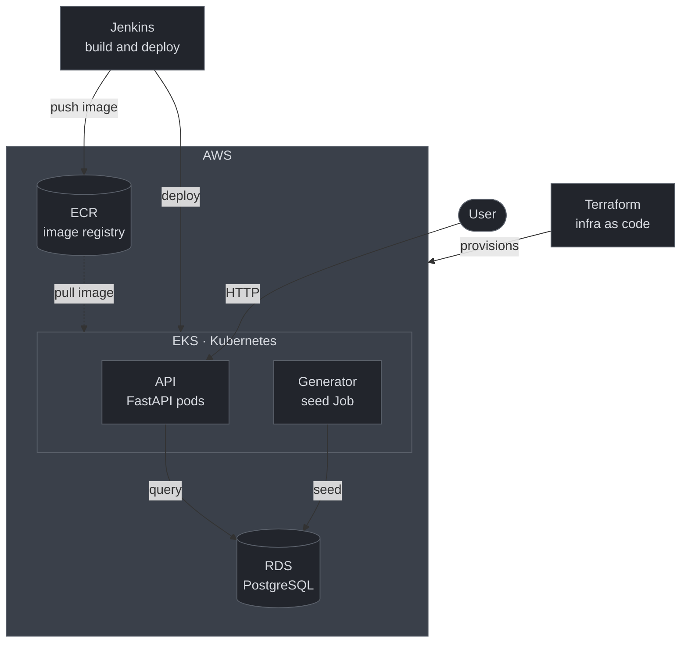
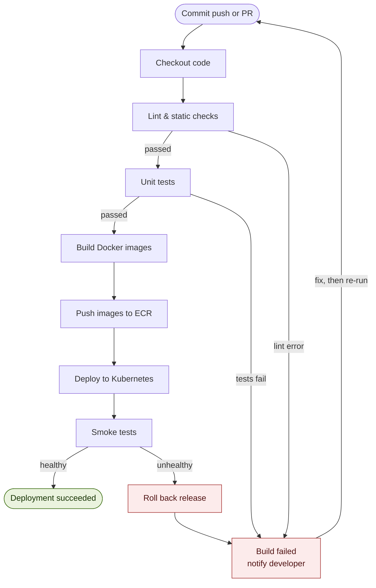

# VNS Research Platform

[](https://www.docker.com/)
[](https://kubernetes.io/)
[](https://www.terraform.io/)
[](https://aws.amazon.com/)
[](https://www.jenkins.io/)
[](https://www.python.org/)
[](https://fastapi.tiangolo.com/)
[](https://www.postgresql.org/)
[](https://www.linux.org/)

It is a research platform that operates using only software and allows to browse the synthetic experiment data for taVNS (vagus-nerve-stimulation). The hardware has been deliberately left out of consideration since the aim of this project is to gain a complete understanding of cloud and DevOps infrastructure by containerising a small service, orchestrating it on Kubernetes, provisioning it on AWS using Terraform, and then delivering it via a Jenkins pipeline.

> The measurement data is deterministically produced from a seed and is therefore synthetic; it is not genuine medical data and has no research value, it being included merely to provide the infrastructure with some realistic data to work with.

## Table of Contents

- [What It Is](#what-it-is)
- [Architecture](#architecture)
- [Preview in Action](#preview-in-action)
- [Requirements](#requirements)
- [How to Build and Run](#how-to-build-and-run)
- [Project Structure](#project-structure)
- [Roadmap](#roadmap)
- [Advanced Usage: Deploy to AWS](#advanced-usage-deploy-to-aws)
- [License](#license)

## What It Is

A small REST API for browsing "experiments" and "stimulation sessions" is provided by a FastAPI backend, while a separate generator creates synthetic sessions and feeds data into a PostgreSQL database. The entire setup is containerized using Docker, deployed on Kubernetes, provisioned on AWS via Terraform, and released through a Jenkins pipeline.

The "research platform" domain is merely a realistic outer layer covering the infrastructure - what matters is the stack, not the biology.

## Architecture

All the elements on the left have an effect on the platform: Jenkins is responsible for building and deploying, Terraform handles the provisioning of the infrastructure, and the user makes use of the API. All the components within the AWS boundary are in the cloud; the EKS cluster contains two workloads (the API and the generator), while the database is located separately on RDS since it is a managed service outside the cluster.




The CI/CD pipeline operates from top to bottom; when errors occur, the various gates (namely Lint, Unit tests, and Smoke tests) branch off to 'Build failed', after which a loop returns to the top once a fix has been made. If a smoke test fails, the deployment is rolled back.




## Preview in Action

With the stack running locally, the API serves synthetic experiment data:

```bash
$ curl -s http://localhost:8000/experiments
[
  { "id": "exp-001", "protocol": "taVNS-A", "session_count": 12 },
  { "id": "exp-002", "protocol": "taVNS-B", "session_count": 8 }
]
```

The fields listed above are made from the generator's seed—whenever the same seed is used, it always produces the same data.

## Requirements

- [Docker](https://www.docker.com/products/docker-desktop/) and Docker Compose -- required for the local stack (Phase 0).
- [kind](https://kind.sigs.k8s.io/) or [k3s](https://k3s.io/) plus [kubectl](https://kubernetes.io/docs/tasks/tools/) -- optional, for running on Kubernetes locally (Phase 1).
- [Terraform](https://www.terraform.io/) and an [AWS](https://aws.amazon.com/) account -- optional, for the cloud deployment (Phase 3). 

## How to Build and Run

1. Clone the repository and enter the project directory:
   ```bash
   git clone https://github.com/your-username/vns-research-platform.git
   cd vns-research-platform
   ```

2. Start the local stack (API + database + generator) with Docker Compose:
   ```bash
   docker compose up --build
   # or: make up
   ```

3. Query the API from another terminal:
   ```bash
   curl -s http://localhost:8000/experiments
   ```

4. Stop and clean up:
   ```bash
   docker compose down
   ```

To run the same services on Kubernetes or on AWS, see [Roadmap](#roadmap) and [Advanced Usage: Deploy to AWS](#advanced-usage-deploy-to-aws).

## Project Structure

```text
vns-research-platform/
│
├── README.md                     # this file
├── Makefile                      # make up / test / build / deploy -- one-liner commands
├── docker-compose.yml            # local dev: api + db + generator on laptop
├── Jenkinsfile                   # pipeline definition (calls ci/*.sh)
│
├── jenkins/                      # how to run Jenkins itself (a server, not a SaaS)
│   ├── Dockerfile                #   Jenkins image with preinstalled plugins
│   ├── plugins.txt               #   plugin list (workflow-aggregator, docker, kubernetes, git…)
│   ├── casc.yaml                 #   Configuration as Code -- Jenkins config as code
│   └── docker-compose.yml        #   run the Jenkins controller locally (Phase 2)
│
├── api/                          # Python backend (FastAPI)
│   ├── app/
│   │   ├── main.py               #   endpoints: GET /experiments, GET /sessions/{id}
│   │   ├── models.py             #   ORM models (SQLAlchemy)
│   │   ├── schemas.py            #   validation/serialization (Pydantic)
│   │   ├── db.py                 #   PostgreSQL connection
│   │   └── config.py             #   configuration from env vars (12-factor)
│   ├── tests/                    #   unit tests (pytest)
│   ├── requirements.txt
│   └── Dockerfile                #   API image
│
├── data-generator/               # synthetic data (deterministic, seeded)
│   ├── generate.py               #   creates synthetic sessions and seeds the DB
│   ├── protocols.yaml            #   protocol parameter dictionary to sample from
│   ├── requirements.txt
│   └── Dockerfile
│
├── deploy/                       # Kubernetes
│   ├── base/                     #   base manifests
│   │   ├── api-deployment.yaml   #     API Deployment
│   │   ├── api-service.yaml      #     Service (ClusterIP/LoadBalancer)
│   │   ├── postgres.yaml         #     Postgres (StatefulSet + PVC) -- in-cluster to start
│   │   ├── configmap.yaml        #     non-sensitive config
│   │   └── secret.example.yaml   #     secret TEMPLATE (real secrets stay out of git)
│   ├── kind/                     #   local cluster config (kind/k3s) 
│   └── job-seed.yaml             #   Job that runs the generator after deploy
│
├── infra/                        # Terraform -- AWS
│   ├── main.tf                   #   VPC, EKS, RDS (Postgres), ECR, IAM
│   ├── variables.tf              #   parameters (region, sizes, names)
│   ├── outputs.tf                #   cluster/RDS endpoints, ECR address
│   ├── backend.tf                #   state in S3 + DynamoDB lock
│   └── versions.tf               #   pinned provider versions
│
├── ci/                           # pipeline logic (the thin Jenkinsfile calls these)
│   ├── build.sh                  #   build + tag images
│   ├── test.sh                   #   lint + tests
│   └── deploy.sh                 #   push to ECR + apply manifests to the cluster
│
└── docs/
    └── runbook.md                #   local + AWS setup, step by step
                                   #   (architecture and CI/CD diagrams live in README.md)
```

## Roadmap

Local-first -- cheap and in order. You do not pay for the cloud until Phase 3.

| Phase | What you do | 
|---|---|
| **0** | `docker compose up` — API + db + generator on your laptop  |
| **1** | The same stack on local Kubernetes (kind/k3s), manifests from `deploy/base` | 
| **2** | Jenkins in Docker locally; pipeline lint → test → build → push (local registry) | 
| **3** | Terraform provisions EKS + RDS + ECR; Jenkins deploys to AWS | 
| **4 (optional)** | Ingress + HTTPS, Prometheus + Grafana, HPA (autoscaling) | 

## Advanced Usage: Deploy to AWS

Once the local stack works, provision the cloud infrastructure and deploy to it:

```bash
cd infra
terraform init
terraform apply          # creates VPC, EKS, RDS, ECR, IAM roles

cd ..
make deploy              # push images to ECR + apply manifests to EKS
```

When you are done, tear everything down to stop billing:

```bash
cd infra && terraform destroy
```

> Set an [AWS budget alert](https://docs.aws.amazon.com/cost-management/latest/userguide/budgets-managing-costs.html) before your first `apply`. EKS and RDS both bill by the hour, whether or not the platform is in use.


## License

Distributed under the [MIT License](LICENSE).
